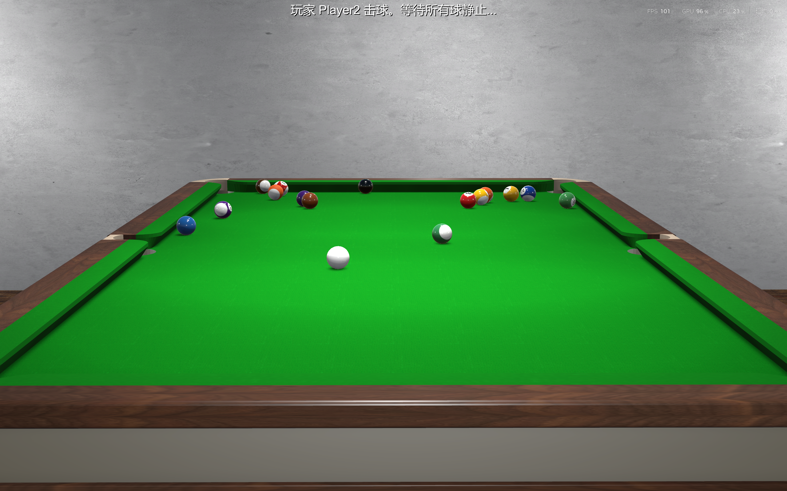

# 计算机图形学大作业实验报告：3D台球游戏

## 1. 项目概况

    这是一款名为`SYSU Billiards Tournament`(中山大学台球大师赛)的3D台球游戏。游戏通过 `unity`虚幻引擎开发，核心目标是实现**相机与球杆的深度联动** ：相机能够以俯瞰视角聚焦母球，并支持玩家通过鼠标旋转观察；同时，球杆必须始终与相机视角同步，指向母球中心。此外，系统需具备智能状态切换功能，在击球后保持视角静止，并在球静止后丝滑回归。

    除了参考了市面上部分已知的台球游戏的游戏逻辑外，此项目从建模到代码全程由我们小组人员制作开发。

## 2. 玩法介绍

* 按下鼠标左键左右移动能够转动球杆击球方向；上下移动能够移动视角。
* 按下ctrl键后(保持)，按下鼠标左键前后移动，能够拉动球杆完成击球动作。
* 在犯规时进行自由球选择环节，通过鼠标在台面上移动选择母球放置位置，左键确定放置。

## 3. 功能思路

本项目采用基于组件（Component-Based）的架构设计，核心功能划分为物理仿真、游戏逻辑控制、摄像机系统与交互反馈四大模块。

1. **物理仿真设计**：

   * 不单纯依赖物理引擎的默认设置，而是针对台球运动特性定制物理参数。
   * 重点模拟台球在台泥上的**滚动阻力**（Rolling Drag）与**旋转衰减**（Spin Drag）。
   * 特别设计了**库边物理响应**：当球体撞击库边（Cushion）时，需要额外的旋转动能损失模拟，以符合真实物理表现。
   * 击球机制不仅包含线性推力（Force），还需支持偏心击球产生的**加塞/自旋**（Torque）。
2. **游戏状态机（FSM）设计**：

   * 台球游戏具有明显的阶段性（瞄准 -> 击球 -> 运动 -> 结算 -> 下一回合）。为此设计了有限状态机（Finite State Machine）来严格管理游戏流程。
   * 状态流转覆盖：`Aiming`（玩家操作）-> `Moving`（物理演算，锁定输入）-> `EndTurnCheck`（规则判定）-> `Setup`（复位/摆球）等。
3. **智能摄像机控制策略**：

   * 摄像机并非简单的“跟随”或“固定”，而是根据游戏状态动态切换行为。
   * **瞄准模式**：以母球为中心进行轨道旋转（Orbit），支持缩放与俯仰视角。
   * **运动模式**：在击球瞬间锁定视角位置，或平滑跟随，避免强烈眩晕感。
   * **上帝视角**：在放置自由球时，无缝切换至顶部俯视相机。
4. **交互与规则系统**：

   * **自由球机制**：利用射线检测技术（Raycasting）将二维屏幕坐标映射到三维桌面平面，实现精准摆球。
   * **规则判定**：自动识别进球类型（全色/花色）、犯规检测（母球落袋）及胜负判定（黑八规则）。

## 4. 实现过程

### 4.1 核心物理引擎 (`BallPhysics.cs`)

物理模块基于 Unity 的 `Rigidbody` 组件进行二次封装：

* **基础参数配置**：在 `Awake` 中初始化质量（`mass`）、线性阻力（`rollingDrag`）和角阻力（`spinDrag`），并计算球体的转动惯量（Inertia Tensor）以获得更真实的滚动效果。
* **库边碰撞优化**：利用 `OnCollisionEnter` 监听碰撞事件。当检测到与 `Cushion`（库边）碰撞时，临时增大 `angularDrag`（乘以 `cushionSpinDampingMultiplier`），模拟撞库后的剧烈旋转损耗，随后延时恢复。
* **击球接口实现**：提供 `ReceiveStrikeImpulse` 方法，接收来自球杆的两个向量：
  * **线性冲量**：`ApplyLinearImpulse` 用于产生位移。
  * **角冲量**：`ApplyAngularImpulse` 根据击球点偏移量产生旋转（加塞效果）。

### 4.2 游戏流程控制 (`GameManager.cs`)

作为游戏的中枢神经，维护了一个完整的 `GameState` 枚举状态机：

* **状态管理**：
  * `Update` 循环中根据当前状态执行逻辑。例如在 `Moving` 状态下，持续监测所有球体的速度。
  * 实现 `CheckAllBallsStopped()` 函数，当所有球体速度低于 `stopThreshold` 时，触发从 `Moving` 到 `EndTurnCheck` 的转换。
* **规则逻辑**：
  * `ProcessTurnResult` 负责结算。通过对比 `pocketedBallsThisTurn`（本回合落袋球）与玩家归属（`player1Group`），自动判定是否犯规、是否交换球权或游戏结束。
  * 处理“自由球”逻辑：当发生母球落袋犯规时，切换至 `FreeBallPlacement` 状态，暂停常规输入。

### 4.3 智能摄像机系统 (`CameraController.cs`)

摄像机控制器通过状态模式（State Pattern）管理视角行为：

* **状态流转**：定义 `Aiming`, `Moving`, `PlacementView` 等枚举。
* **瞄准控制 (`Aiming`)**：
  * 基于球坐标计算 Pivot 点。
  * 读取 `Input.GetAxis` 控制水平偏航（Yaw）和垂直俯仰（Pitch）。
  * 使用数学公式更新相机位置：`Position = Target + Rotation * (0, 0, -Distance)`。
* **平滑过渡**：在状态切换（如从 `Moving` 回到 `Aiming`）时，使用 `Transitioning` 状态配合插值算法（Lerp），使相机平滑飞回母球后方，而非生硬跳变。

### 4.4 自由球放置机制 (`CuePlacementController.cs`)

实现了从 2D 屏幕空间到 3D 世界空间的交互：

* **数学平面构建**：创建一个虚拟的数学平面 `new Plane(Vector3.up, height)` 与台面高度对齐。
* **射线检测**：
  * 在 `Update` 中调用 `camera.ScreenPointToRay(Input.mousePosition)` 生成射线。
  * 使用 `plane.Raycast` 计算射线与台面的交点。
* **位置修正**：将计算出的交点叠加 `cueBallRadius` 和 `placementYOffset`，确保母球刚好放置在台面上方而不发生穿模。
* **完成放置**：点击确认后，通过 `gameManager.NotifyPlacementCompleted()` 通知系统恢复物理模拟并进入瞄准阶段。

### 4.5 UI 事件系统 (`GameStatusDisplay.cs`)

* 采用**观察者模式**解耦 UI 与逻辑。
* `GameManager` 定义 `OnStatusUpdate` 事件。
* UI 脚本订阅该事件，仅在状态变更时更新文本，避免要在 `Update` 中轮询检查状态字符串。

## 5. 项目亮点与创新分析

### 5.1 物理模拟的真实感优化算法：动态库边阻尼

- **关键问题**：Unity 默认的物理引擎（PhysicMaterial）难以模拟真实台球撞击库边（Cushion）后的动能衰减特性。仅调整摩擦力或反弹系数会导致球体要么反弹无力，要么像永动机一样无法静止。
- **解决方案**：
  - 在 `BallPhysics.cs` 中实现自定义碰撞响应。当检测到 `OnCollisionEnter` 撞击对象为库边时，瞬间将球体的角阻力（Angular Drag）提升 5 倍（`cushionSpinDampingMultiplier`）。
  - **效果对比**：
    - *优化前*：大力击球后，球体在库边来回反弹次数过多，且旋转一直保持高速。
    - *优化后*：球体撞库后迅速损失旋转动能，不仅轨迹更符合物理直觉，也防止了极端情况下的无限震荡。

### 5.2 广播级平滑运镜系统

- **方法设计**：摒弃了简单的“摄像机做子物体”方案，开发了基于状态机的独立摄像机控制器（`CameraController.cs`）。
- **效果提升**：
  - **平滑过渡**：在“瞄准”与“跟随”状态切换时，引入 `Vector3.Lerp` 实现位置与旋转的软插值，避免了镜头硬切带来的视觉突兀感。
  - **防眩晕设计**：在球体高速运动时，摄像机并非死板锁定球心，而是保持相对偏移，模拟真实比赛转播的跟拍效果。

### 5.3 基于数学平面的高鲁棒性自由球交互

- **方法来源**：参考 RTS（即时战略）游戏中的单位放置算法。
- **对比分析**：
  - *常规碰撞检测*：若使用物理射线检测台面 Collider，容易因球体模型半径导致放置位置计算偏差，甚至发生“球体一半在桌内”的穿模 Bug。
  - *本项目方案*：构建虚拟数学平面 `new Plane(Vector3.up, ...)`。直接计算视线与平面的几何交点，并强制叠加 $Y$ 轴半径偏移。
- **优势**：计算复杂度从 $O(\log N)$ 降为 $O(1)$，且从数学上保证了放置位置的绝对合法性（零穿模）。

### 5.4 观察者模式驱动的 UI 架构

- **效率提升**：使用 C# 事件（`Action`）重构了 UI 系统。相比于传统的 `Update()` 轮询检测状态字符串，事件驱动机制确保了仅在游戏逻辑发生实质变化时才触发 UI 重绘。这不仅降低了 CPU 开销，更实现了逻辑层与表现层的完美解耦。

### 5.5 全自主精细化建模与材质渲染

- **全流程自主开发**：区别于使用 Asset Store 现成资产的常规做法，本项目的小组成员利用 Blender 等专业建模软件，从零构建了包括标准斯诺克球桌、高精度球杆以及室内装饰在内的所有 3D 模型资产。
- **基于物理的材质表现 (PBR)**：
  - **台球质感**：通过精心调整材质的 **平滑度 (Smoothness)** 和 **高光 (Specular)** 参数，完美复刻了酚醛树脂球体特有的反光特性与“玻璃质感”。
  - **台泥细节**：为桌面应用了高分辨率的织物纹理（Fabric Texture）并配合法线贴图（Normal Map），在光照下呈现出真实绒布的微观凹凸感，而非单调的绿色色块。
- **模型优化**：在保证视觉精度的同时，对球杆和桌腿等复杂几何体进行了合理的拓扑优化，确保在实时渲染中的帧率稳定性。

## 6. 实验结果展示

- **初始视角**：
  
- **击球瞬间**：
  
- **多球碰撞**：
  
- **自由球选择阶段：
  **

## 7. 遇到的问题及解决方案

1. **问题一**：球体高速撞击时穿模。
   - **解决方案**：将 Rigidbody 的 Collision Detection 模式改为 `Continuous Dynamic`。
2. **问题二**：自由球放置时位置不准。
   - **解决方案**：引入数学平面计算（详见 5.3 节）。

## 8. 实验心得与总结

这个项目对于我们小组是许多个“第一次”所构成的挑战：第一次做游戏，第一次使用unity，第一次建模，第一次使用C#编程，第一次将一个项目从构想到落地的过程完完全全展现出来。当从项目构建导出exe文件，成功打开并运行的那一刻，我们每个人心中都充满了自豪感。当然这份项目依然是不完美的：例如杆没有做实体所以会出现穿模情况；台球的碰撞与运动与真实世界存在一定差距；没有实现加塞之类的台球进阶技巧。但是在有了前面过程积累下的经验后，我相信我们后续可以更加完善这个项目，做成一款真正的、能够面向用户的3d台球游戏。
